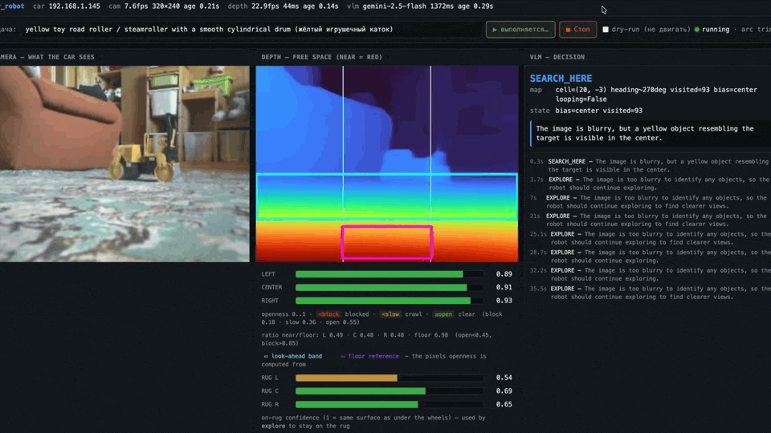

# car_robot

ESP32-CAM car experiments.

*`tools/dashboard.py` observability UI mid-task: the raw 320×240 camera (left),
the Depth-Anything-V2 free-space heatmap with the look-ahead band and floor
reference (center), and the live VLM decision log with per-zone openness and
on-rug confidence (right).*

<!-- The full-resolution screen capture (robocar.mp4, ~60 MB) is intentionally
     kept out of git; this GIF is a trimmed, downscaled excerpt of it. -->

The autonomy stack is split into three layers:

1. `tools/reflex_drive.py`: fast local perception and motor-control loop.
2. Gemini/local VLM: slow goal updates and route bias for the fast loop.
3. `tools/self_improve_loop.sh`: periodic Codex CLI self-improvement loop over recent logs/photos.

See [docs/self_improvement.md](docs/self_improvement.md) for the layer-3 harness and run commands.
